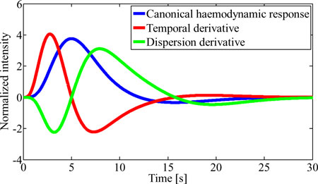
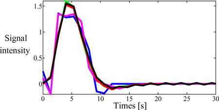
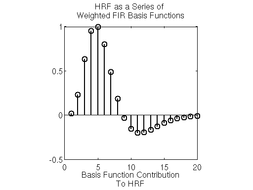
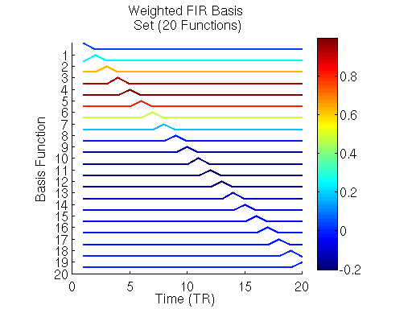
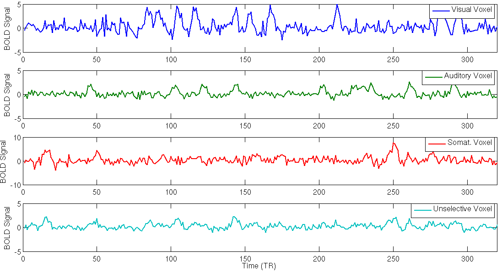
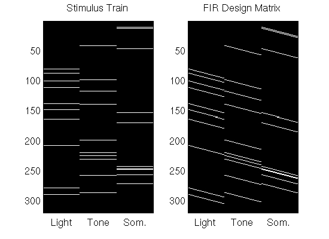
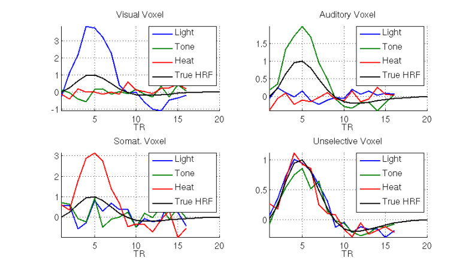

<!-- slide bg="[[AdobeStock_477448716 [Converted].png]]" data-background-opacity="0.5"-->

::: block <!-- element class="title-border" -->
## Estimating the Hemodynamic Response Function
Lynne J Williams 
March 28, 2022 
:::

--

### Why estimate HRFs?

- gives better estimation of activation/deactivation [Boch et al., 2021]
  - remember BOLD is a proxy for neural activation/deactivation
+ allows for inter-voxel variability
  - different HRF rise times for different brain regions/tasks/populations 
    - children's HRFs rise faster than adults' 
    - task differences in HRF rise times

--

### Two main methods

<split even gap=2>
::: block 
#### Model-based

Assume shape of HRF  (e.g., double gamma, Poisson, radial-basis, inverse logit, etc.)  
[Lei et al., 2012] 

Double Gamma distribution <!-- element align="center" style="font-size:smaller; margin:0"--> [[Stack Exchange](https://i.stack.imgur.com/4jAuf.png)]

:::

::: block 
#### Model-free

Estimate voxel-specific HRF and use the estimated HRF to deconvolve BOLD signal  [Lei et al., 2012; Wink et al., 2008; Zhang et al., 2012] 

![[fncom-09-00054-g0001.jpeg]]
Estimations of HRF in fMRI where black box is input<!-- element align="center" style="font-size:smaller; margin:0"--> [Rosa et al, 2015] 
:::
</split>

--

### The BOLD response is assumed to be linear time-invariant
HRF can be represented as a linear combination of basis functions <!-- element align="center" drag="100 10" drop="0 25"-->

note: Here's the problem. We want a mathematical description of a curve or any other data distributed over space, time, and other types of continuum. Flexibility is a central issue since we usually cannot say in advance how complex the curve will be, or specify certain of its characteristics. We don't have the time or patience to search some handbook of known functions for one that looks like what we want to study, either. Moreover, however it is that we design our mathematical function, we will want to do any computation that is needed to fit the data quickly and with a minimum of programming.  

--

### What are basis functions ? [Ramsay & Silverman, 1997]

A set of basic functional building blocks that can be stacked on top of one another to generate curves distributed over time or space (or other continuum).
$$f(t) = a_1\phi_{1}(t)+a_2\phi_{2}(t)+\ldots+a_k\phi_k(t)$$
This is a linear combination of building blocks, where $\phi_k(t)$ is the $k$th function in our toolbox and $a_k$ is a constant. $\phi_k(t)$ is called a basis function.

note: We need, therefore, a set of basic functional building blocks that can be stacked on top of one another so as to have the features that we need. Mathematical Lego, in other words. Since this is mathematics, we use the symbol $\phi_k(t)$ to stand for the $k$th function in our toy box, and we call this the $k$th _basis function_.  
  
By "stacking" in mathematics we mean adding things, possibly after multiplying each of them by its own constant. So here is how we will construct a function $f(t)$ using $K$ of these blocks:  
  
_f(t)_ = _a_1ø1(_t_) + _a_2ø2(_t_) + .... + _a_køk(_t_)  
  
In math-speak, this is a "linear combination". The construction of an actual function then becomes a matter of assigning values to the $Κ$ constants $a_k$.

--

### Why basis functions?

<!---->  Illustration of the double-gamma function and its partial derivatives. [Barré et al., 2012]

<!---->  Modeled haemodynamic response (block paradigm): noisefree (black), FIR (blue), IIR (Magenta), linear regression (green), FOP (red). [Barré et al., 2012]

--

### Now to model the HRF

Let's say we have an HRF that looks like this:  <!---->

note: We would like to be able to model the HRF as a weighted combination of simple basis functions. The simplest set of basis functions is the FIR basis, which is a series of  distinct unit-magnitude (i.e. equal to one) impulses, each of which is delayed in time by  TRs.

--

### Now to model the HRF

<split left="1" right="4" gap=2>

<!---->

Let's model that HRF using Finite Impulse Respose basis set: <!---->

</split>

note: Each of the basis functions  has an unit impulse that occurs at time ; otherwise it is equal to zero. Weighting each basis function  with the corresponding value of the HRF at each time point , followed by a sum across all the functions gives the target HRF in the first plot above. The FIR basis model makes no assumptions about the shape of the  HRF–the weight applied to each basis function can take any value–which allows the model to capture a wide range of HRF profiles.

Given an experiment where various stimuli are presented to a subject and BOLD responses evoked within the subject’s brain, the goal is to determine the HRF to each of the stimuli within each voxel. Let’s take a look at a concrete example of how we can use the FIR basis to simultaneously estimate HRFs to many stimuli for multiple voxels with distinct tuning properties.

--

### Now to model the HRF

4 voxels:

<!---->

note: For this example we revisit a simulation of voxels with 4 different types of tuning. One voxel is strongly tuned for visual stimuli (such as a light), the second voxel is weakly tuned for auditory stimuli (such as a tone), the third is moderately tuned for somatosensory stimuli (such as warmth applied to the palm), and the final voxel is unselective (i.e. weakly and equally selective for all three types of stimuli). We simulate an experiment where the blood-oxygen-level dependent (BOLD) signals evoked  in each voxel by a series of stimuli consisting of nonoverlapping lights, tones, and applications of warmth to the palm, are measured over  fMRI measurments (TRs).

--

### Now to model the HRF

<!---->

note: Now let’s estimate the HRF of each voxel to each of the  stimulus conditions using an FIR basis function model. To do so, we create a design matrix composed of successive sets of delayed impulses, where each set of impulses begins at the onset of each stimulus condition. For the ![[T \times C]](https://s0.wp.com/latex.php?latex=%5BT+%5Ctimes+C%5D&bg=ffffff&fg=4e4e4e&s=0&c=20201002)-sized stimulus onset matrix , we calculate an ![[T \times HC]](https://s0.wp.com/latex.php?latex=%5BT+%5Ctimes+HC%5D&bg=ffffff&fg=4e4e4e&s=0&c=20201002) FIR design matrix , where  is the assumed length of the HRF we are trying to estimate. The code for creating and displaying the design matrix for an assumed HRF length  

In the right panel of the plot above, we see the  form of the FIR design matrix  for the stimulus onset on the left. For each voxel, we want to determine the weight on each column of  that will best explain the BOLD signals  measured from each voxel. We can form this problem in terms of a General Linear Model:

Where  are the weights on each column of the FIR design matrix. If we set the values of  such as to minimize the sum of the squared errors (SSE) between the model above and the measured actual responses

,

then we can use the Ordinary Least Squares (OLS)  to solve the for .  Specifically, we solve for the weights as:

--

### Now to model the HRF

<!---->

note: Once determined, the resulting ![[CH \times V]](https://s0.wp.com/latex.php?latex=%5BCH+%5Ctimes+V%5D&bg=ffffff&fg=4e4e4e&s=-1&c=20201002) matrix of weights  has the HRF of each of the  different voxels to each stimulus condition along its columns. The first  (1-16) of the weights along a column define the HRF to the first stimulus (the light). The second  (17-32) weights along a column determine the HRF to the second stimulus (the tone), etc… Below we parse out these weights and display the resulting HRFs for each voxel

Here we see that estimated HRFs accurately capture both the shape of the HRF and the selectivity of each of the voxels. For instance, the HRFs estimated from the responses of first voxel indicate strong tuning for the light stimulus. The HRF estimated for the light stimulus has an amplitude that is approximately 4 times that of the true HRF. This corresponds with the actual tuning of the voxel (compare this to the value of ). Additionally, time delay till the maximum value (time-to-peak) of the HRF to the light is the same as the true HRF. The first voxel’s HRFs estimated for the other stimuli are essentially noise around baseline. This (correctly) indicates that the first voxel has no selectivity for those stimuli. Further inspection of the remaining estimated HRFs indicate accurate tuning and HRF shape is recovered for the other three voxels as well.

--

<h3 style="margin-top: 25%;">PROS and CONS</h3>

--

### Tools

- rsHRF [Wu et al., 2021]
- FLOBS (FIMRIB Linear Optimal Basis Sets) [Woolrich et al., 2004]
- SPM Optimal Basis Sets [Ashburner et al., 2021]
- hrf_estimation [Pedregosa & Eickenberg, 2015]

--

### Further Reading
[^Ashburner]: John Ashburner, Gareth Barnes, Chun-Chuan Chen, Jean Daunizeau, Guillaume Flandin, Karl Friston, Darren Gitelman, Volkmar Glauche, Rik Henson, Chloe Hutton, Amirhossein Jafarian, Stefan Kiebel, James Kilner, Vladimir Litvak, Jérémie Mattout, Rosalyn Moran, Will Penny, Christophe Phillips, Adeel Razi, Klaas Stephan, Sungho Tak, Ashley Tyrer, & Peter Zeidman (2021). _SPM 12 Manual_. London, UK: Functional Imaging Laboratory, Wellcome Centre for Human Neuroimaging. Retrieved from SPM12 Manual - Wellcome Centre for Human Neuroimaging.
[^Barbé]: Barbé, K., Moer, W. V., & Nagels, G. (2012). [Fractional-Order Time Series Models for Extracting the Haemodynamic Response From Functional Magnetic Resonance Imaging Data](https://doi.org/10.1109/tbme.2012.2202117). _IEEE Transactions on Biomedical Engineering_, _59_(8), 2264–2272. doi:10.1109/tbme.2012.2202117
[^Lei]: Lei, Y., Tong, L., & Yan, B. (2013). [A Mixed L2 Norm Regularized HRF Estimation Method for Rapid Event-Related fMRI Experiments](https://doi.org/10.1155/2013/643129). _Computational and Mathematical Methods in Medicine_, _2013_, 643129. doi:10.1155/2013/643129
[^Boch]: Boch, M., Karl, S., Sladky, R., Huber, L., Lamm, C., & Wagner, I. C. (2021). Tailored haemodynamic response function increases detection power of fMRI in awake dogs (Canis familiaris). _NeuroImage_, _224_, 117414. doi:10.1016/j.neuroimage.2020.117414
[^Pedregosa]: Pedregosa, F. & Eickenberg, M. (2015). [hrf_estimation Python module](https://pypi.org/project/hrf_estimation/). Pypi.
[^Ramsay]: Ramsay, JO,  & Silverman, BW (1997). [Functional Data Analysis,](http://www.springer-ny.com/detail.tpl?cart=10656288402782197&ISBN=0387949569) New York: Springer.
[^Rangaprakash]: Rangaprakash, D., Wu, G., Marinazzo, D., Hu, X., & Deshpande, G. (2018). [Hemodynamic response function (HRF) variability confounds resting‐state fMRI functional connectivity](https://doi.org/10.1002/mrm.27146). _Magnetic Resonance in Medicine_, _80_(4), 1697–1713. doi:10.1002/mrm.27146
[^Rosa]: Rosa, P. N., Figueiredo, P., & Silvestre, C. J. (2015). [On the distinguishability of HRF models in fMRI](https://doi.org/10.3389/fncom.2015.00054) _Frontiers in Computational Neuroscience_, _9_, 54. doi:10.3389/fncom.2015.00054
[^Stansbury]: Stansbury, D. (2012). [fMRI in Neuroscience: Modeling the HRF With FIR Basis Functions](https://theclevermachine.wordpress.com/2012/12/16/fmri-in-neuroscience-modeling-the-hrf-with-fir-basis-functions/). Website retrieved 2022-03-26.
[^Lex]: Transnational College of Lex. (2012). [Who Is Fourier?: A Mathematical Adventure](https://www.amazon.ca/Fourier-Mathematical-Adventure-Transnational-College/dp/0964350408). Language Research Foundation.
[^Turner]: Turner, M. P. (2020). _Bolder than Bold: Changes in Neurophysiologic Underpinnings of fMRI Signal with Age and Task Demand_. Dissertation. University of Texas at Dallas.
[^Wink]: Wink, AM,  Hoogduin, H, &  Roerdink, JBTM (2008). [Data-driven haemodynamic response function extraction using Fourier-wavelet regularised deconvolution](https://doi.org/10.1186/1471-2342-8-7). _BMC Medical Imaging, 8,_ 7. doi:10.1186/1471-2342-8-7
[^Woolrich]: Woolrich, M. W., Behrens, T. E. J., & Smith, S. M. (2004). Constrained linear basis sets for HRF modelling using Variational Bayes. _NeuroImage, 21:4_, 1748-1761.
[^Wu]: Wu, G.-R., Colenbier, N., Bossche, S. V. D., Clauw, K., Johri, A., Tandon, M., & Marinazzo, D. (2021). rsHRF: A toolbox for resting-state HRF estimation and deconvolution. _NeuroImage_, _244_, 118591. doi:10.1016/j.neuroimage.2021.118591
[^Zhang]: Zhang, T, Li, F, Beckes, L, Brown, C, Coan, JA (2012). [Nonparametric inference of the hemodynamic response using multi-subject fMRI data](https://doi.org/10.1016/j.neuroimage.2012.08.014). _NeuroImage, 63, 3_, 1754-1765. doi:10.1016/j.neuroimage.2012.08.014
